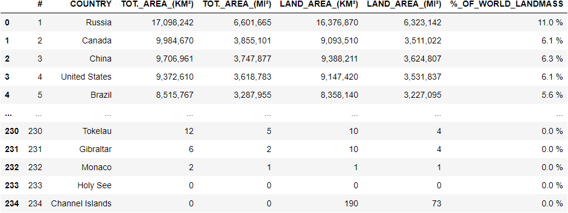
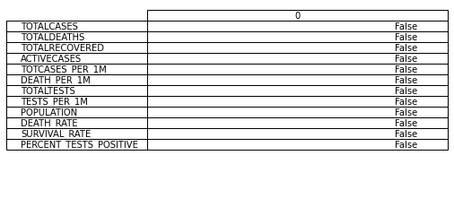
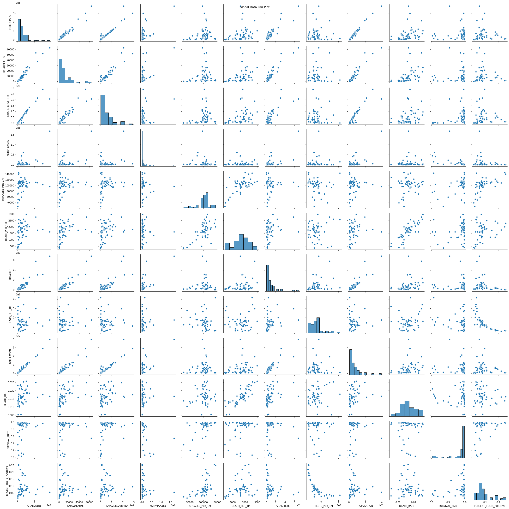
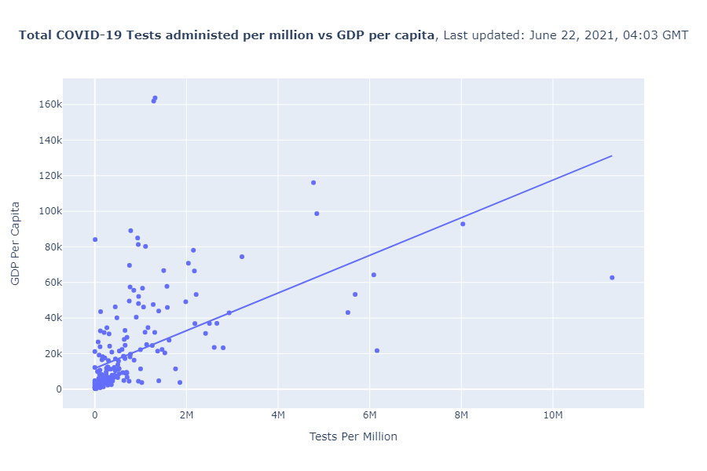
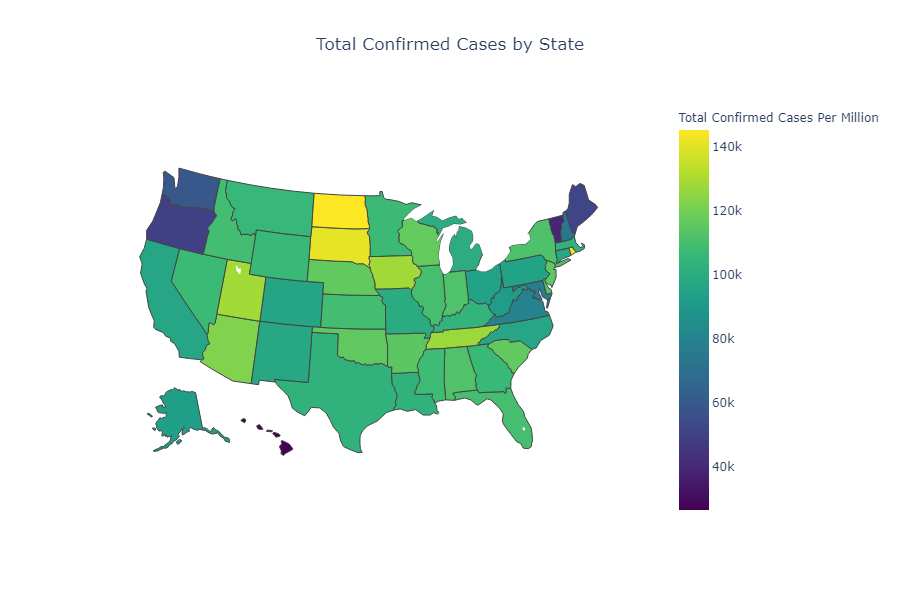
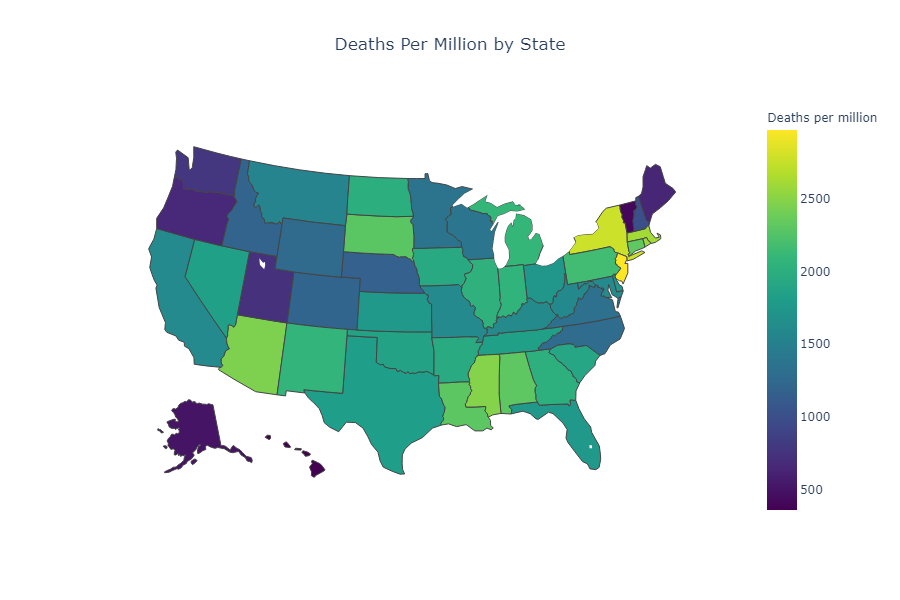

# Wrangling Covid-19 Datasets for Use in Python Data Exploration test

---
Covid-19 is a disease caused by SARS-CoV-2. The World Health Organization declared the disease a pandemic on March 11th, 2020. Since then there have been numerous outlets that have compiled data and presented information pertaining to its spread. Information from Worldometer, a reference website reputed by the American Library Association, will be used as the primary dataset. Worldometer gathers and compiles information from various sources, including government communication channels as well as local media. It provides live updates on the total cases, new cases, total deaths, new deaths,recoveries and critical cases by country, territory or conveyance pertaining to Covid-19.

---

## Overview:
This data exploration will provide a broad level overview of the Covid-19 pandemic based on the most recently updated information on Worldometer. Datasets from various sources will be gathered using webscraping with BeautifulSoup and Selenium; data will then be stored in Pandas dataframes, and cleaned.  The final dataset will demonstrate its readiness for use in visualization with MatplotLib, Seaborn, and Plotly, linear regression analysis with Statsmodel Summary, and geomapping with Plotly Express. 

## Project Files:
- [Analysis.pdf](https://github.com/OmkarShivaprasad/Covid19_DataExploration/blob/main/Analysis.pdf)- *This will be the most user friendly option to veiw the code and outputs of this project.*
- [Analysis.ipynb](https://github.com/OmkarShivaprasad/Covid19_DataExploration/blob/main/Analysis.ipynb)- Jupyter Notebook
- [Analysis.py](https://github.com/OmkarShivaprasad/Covid19_DataExploration/blob/main/Analysis.py)- Source Code and Markdown
- [global_covid_final_data.csv](https://github.com/OmkarShivaprasad/Covid19_DataExploration/blob/main/global_covid_final_data.csv)- Final Cleaned Global Dataset
- [us_covid_final_data.csv](https://github.com/OmkarShivaprasad/Covid19_DataExploration/blob/main/us_covid_final_data.csv)- Final Cleaned US Dataset
- [Images](https://github.com/OmkarShivaprasad/Covid19_DataExploration/tree/main/images)- Folder containing images of plots, cell outputs, and geomaps
---

## Table of Contents:

- [Steps in Analysis](#Steps-in-Analysis)
- [Data Sources](#Data-Sources)
- [Data Gathering and Cleaning](#Data-Gathering-and-Cleaning)
  * [Global Data](#Global-Data)
  * [United States Data](#United-States-Data)
- [Visualization](#Visualization)
  * [Bar Subplots](#Bar-Subplots)
  * [Pie Subplots](#Pie-Subplots)
  * [Pearson Correlation Heatmaps](#Pearson-Correlation-Heatmaps)
  * [Bubble Plots](#Bubble-Plots)
  * [Scatter Plots](#Scatter-Plots)
  * [Pair Plot](#Pair-Plot)
- [Geomapping](#Geomapping)
  * [Global Data](#Global-Data)
  * [United States Data](#United-States-Data)

---

## Steps in Analysis:
1. Import required libraries

2. Gather data

	- Webscraping with BeautifulSoup and Selenium
	- Reading in CSV files
	- Saving information into Pandas dataframes

3. Clean data

	- Manage null and missing values
	- Drop unwanted rows and columns
	- Rename columns and observations
	- Format datatypes
	- Add columns with calculations
	- Concatenate dataframes

4. Visualization

	- Seaborn | MatPlotLib | Plotly
	- Pearson Correlation Heatmaps
	- Bar Plots
	- Pair Plots
	- Pie Plots
	- Bubble Plots

5. Global GDP Exploration

	- Scatter Plots
	- Pearson Correlation

6. GeoMapping

	- Plotly Library
	- Choropleth
	- ScatterGeo

---

## Data Sources:
- Worldometer Covid-19 Live Information (Countries and US States)
- GDP per Capita (Countries)
- Geospatial Data (Countries and US States)
- Land Size (Countries)

---

## Data Gathering and Cleaning:
 

### *GLOBAL DATA* 
 

**Global Covid-19 Raw Dataset**

**Global Covid-19 Initial Cleaned Dataset**

**Global GDP Per Capita Raw Dataset**

**Global GDP Per Capita Cleaned Dataset**

**Country Area Raw Dataset**

**Country Area Cleaned Dataset**

**Global Data Concatenated with Global GDP Per Capita and Country Area**

**FINAL GLOBAL DATASET**

**All Null Values Managed for Final Global Dataset**

 

### *UNITED STATES DATA* 
 

**United States Raw Dataset**

**United States Cleaned Dataset**

**FINAL US DATASET**

**Null Values Managed for Final US Dataset**

---

## Visualization

 

##### **Bar Subplots**

 

   

##### **Pie Subplots**

  

##### **Pearson Correlation Heatmaps**

 

 

  

##### **Bubble Plots**

  

##### **Scatter Plots**

 

  

##### **Pair Plot**

---

## **StatsModel Summary**

 

### *TOTAL CASES PER MILLION VS GDP*

 

**With Constant**

**Without Constant**

 

 

### *DEATHS PER MILLION VS GDP*

 

**With Constant**

**Without Constant**

 

 

### *TESTS PER MILLION VS GDP*

 

**With Constant**

**Without Constant**

 

 

---

## Geomapping

 

##### **Bubble Plot Geomap**

 

##### **Chloropleth Maps**

 

 

 

